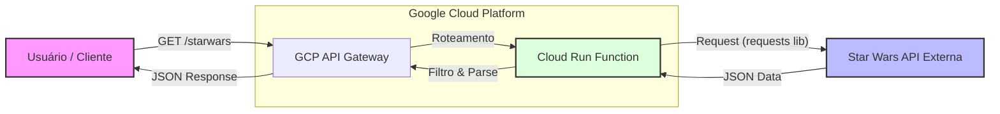

# Star Wars API Challenge - GCP Serverless

Este projeto implementa uma arquitetura Serverless utilizando **Python**, projetada para rodar sobre **Google Cloud Functions** e gerenciada via **API Gateway**.

## Visão Geral da Arquitetura Proposta

### Diagrama da Solução

O diagrama abaixo ilustra o fluxo de dados na arquitetura Serverless proposta:


    

A solução foi desenhada para atender aos requisitos de escalabilidade e desacoplamento:

1.  **Cliente:** Realiza a requisição HTTP.
2.  **GCP API Gateway:** Ponto de entrada único, responsável pelo roteamento e segurança (Configuração em `openapi.yaml`).
3.  **Cloud Functions (2nd Gen):** Processa a lógica de negócio e conecta com serviços externos (Código em `main.py`).
4.  **SWAPI (External):** Fonte de dados da saga Star Wars.

## Tecnologias Utilizadas
* **Linguagem:** Python 3.10+
* **Framework Local:** Google Functions Framework (para simulação fiel do ambiente serverless)
* **Nuvem Alvo:** Google Cloud Platform (Cloud Run Functions + API Gateway)

## Nota sobre o Deploy
O código foi desenvolvido e testado localmente utilizando o `functions-framework` do Google, garantindo compatibilidade total com o ambiente de Cloud. 
Devido a restrições momentâneas de faturamento na conta pessoal do GCP (bloqueio regional de pagamentos), o deploy em produção foi simulado localmente. Os arquivos de configuração (`openapi.yaml`) estão inclusos para demonstrar como a infraestrutura seria provisionada.

## Como rodar localmente

1. Instale as dependências:
   ```bash
   pip install -r requirements.txt

## ônus: Interface Gráfica

O projeto inclui uma interface simples construída com **Streamlit** para facilitar os testes.

Para rodar a interface:
1. Mantenha o backend rodando em um terminal.
2. Em outro terminal, execute:
   ```bash
   streamlit run frontend.py