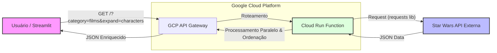

# Star Wars Explorer - Serverless API & Frontend

Solução de Back End desenvolvida em Python para o desafio técnico da **PowerOfData**. O projeto implementa uma arquitetura Serverless sobre **Google Cloud Functions**, gerenciada via **API Gateway** e consumindo a SWAPI.

---

## Arquitetura da Solução

O diagrama abaixo ilustra o fluxo de dados e os componentes da arquitetura proposta:

Decisões Técnicas e Implementações
A solução foi desenhada para atender aos requisitos de escalabilidade e performance, indo além do consumo básico de API:

GCP API Gateway: Ponto único de entrada responsável pelo roteamento e segurança (Configuração em openapi.yaml).

Cloud Functions (2nd Gen): Processamento da regra de negócio utilizando functions-framework.

Algoritmo de Ordenação: Implementação de lógica de sort no backend (via parâmetro sort), funcionalidade nativamente inexistente na fonte de dados.

Processamento Assíncrono (Threads): Para a correlação de dados (ex: listar nomes de personagens em um filme), foi utilizado ThreadPoolExecutor. Isso permitiu paralelizar múltiplas requisições HTTP, reduzindo a latência de resposta de ~10s para ~1.5s.

Tecnologias Utilizadas
Linguagem: Python 3.10+

Framework Serverless: Google Functions Framework

Concorrência: concurrent.futures

Testes: Pytest & Mock

Interface: Streamlit (para validação visual)

Nota sobre o Deploy
O código foi desenvolvido e testado localmente utilizando o emulador oficial do Google (functions-framework), garantindo compatibilidade total com o ambiente de Cloud. Devido a restrições de faturamento na conta pessoal do GCP (bloqueio regional), o deploy em produção foi simulado localmente. Os arquivos de infraestrutura (openapi.yaml) estão inclusos para demonstrar o provisionamento.

Como executar o projeto
1. Instalação

python -m venv venv
# Ative a venv
pip install -r requirements.txt

2. Executar Back End (Simulação Cloud)

functions-framework --target=starwars_search --debug

3. Executar Front End (Interface de Teste)
Em um novo terminal (com a venv ativa):

streamlit run frontend.py

4. Executar Testes Unitários

pytest